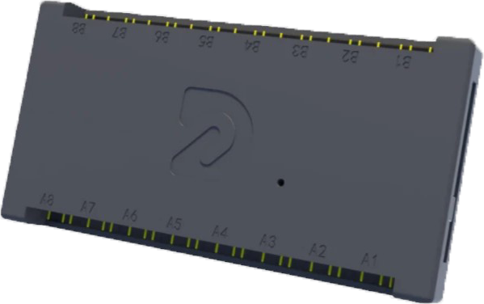

# DRGB-V4F-SRGB-Plugin

This repository was created to translate the plugin used by the DRGB V4F controller for the SignalRGB software.

## README Translation
- [English](README.md)
- [Português](README.pt-BR.md)

<p align="center">
  
</p>
<p align="center">
  
</p>

## Installation

To install the plugin, simply move the [DRGB_V4F.js](./en/DRGB_V4F.js) file to the following location:

```C:\Users\[Your Name]\Documents\WhirlwindFX\Plugins```

After that, the controller should appear under the Devices tab in SignalRGB.

## Compatibility

This plugin is compatible with the following models:

- **DRGB SIG V4F**
- **DRGB CORE V4F**
- **DRGB ULTRA V4F**
- **DRGB LED V4**