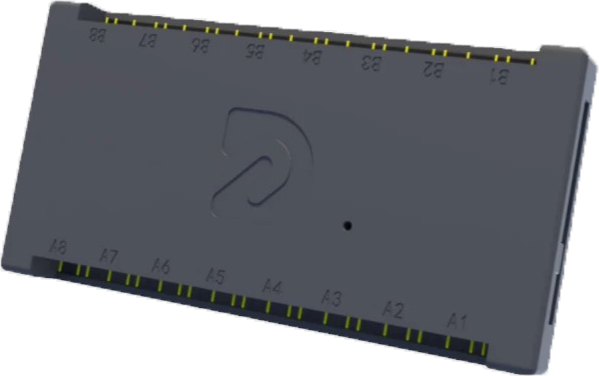

# DRGB-V4F-SRGB-Plugin

Repositório criado com a inteção de traduzir o plugin utilizado pela controladora DRGB V4F para o Software SignalRGB

## README Translation
- [English](README.md)
- [Português](README.pt-BR.md)

<p align="center">
  
</p>
<p align="center">
  
</p>

## Instalação

Para instalar o plugin basta mover o arquivo [DRGB_V4F.js](./pt-BR/DRGB_V4F.js) para a seguinte localização:

```C:\Users\[Seu Nome]\Documents\WhirlwindFX\Plugins```

Após isso a controladora deverá aparecer dentro da aba Devices no SignalRGB.

## Compatibilidade

Este plugin é compativel com os seguintes modelos:

- **DRGB SIG V4F**
- **DRGB CORE V4F**
- **DRGB ULTRA V4F**
- **DRGB LED V4**